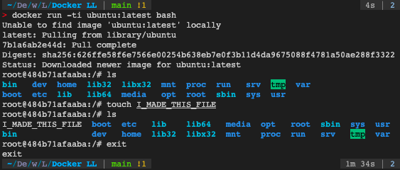
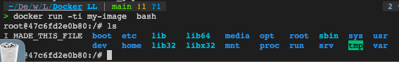
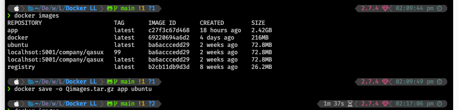

<!-- headingDivider: 2 -->
<!--
theme: gaia
class: lead
-->
# All You Need to Know - Docker 

- Containers: They are sealed, self-contained units of software that have everything needed to run a service.
What you should know(Viewed)

## 1. Installing Docker

<https://docs.docker.com/get-docker/>

## 2. Using Docker

### The Docker flow: Images to containers**

- Image -> running container
- `docker run docker-name`
- `docker ps` -> get information on running container
- image is fixed and does not change
## The Docker flow: Containers to images**
<style scoped>
 {
    font-family: 'Open Sans', sans-serif;
    font-size: 1.2em;
  }

</style>
- running container -> image (files are stored in stopped container)
- `docker ps -a` all container  
- `docker ps -l`  last container  
- topped container has the software installed in it
- docker commit -> container to new image
- Run bash image `docker run -ti ubuntu:latest bash`
- create and give images name
- Run processes in containers



## Running process in Docker**

- containers have a min proceed
- one main process that has name
- -d run detached container in the background
## 3. Under the hood
<style scoped>
 {
    font-family: 'Open Sans', sans-serif;
    font-size: 1.9em;
  }

</style>
Registries in detail

- Kernel : controls and organizes storage, programs and so. allocate resources and so on 
- docker manges kernel 
- cgroup to group process together 
- can be client and server 
  
- docker control socket
```
docker run -ti --rm -v /var/run/docker.sock docker sh
```

# Docker Comose basics 
* docker comose is a tool for defining and running multi-container Docker applications using single configuration file

# configuration
* declarative procedure to execute 
* they allow you to define a set of services that make up your app
* configuration are self documenting ans easy to manage

# Writing a docker compose configuration
* create a configuration file in `yml` format
* name it `docker-compose.yml`
* ymal: Yet Another Markup Language, a human-readable data-serialization language used for configuration files
* many images are available on docker hub
```yml
version: '3.7' # version of docker compose
services: # services to run
  store: # name of service
    build: . # image to use, current directory
    database:
      image: postgres:latest # this will be pulled from docker hub
```

# Docker compose commands
All docker compose commands are run from the directory containing the `docker-compose.yml` file
* `docker-compose up` - start the services # build -> create -> start
  * specify the service name to start only that service `docker-compose up store`
* `docker-compose down` - stop the services, and delete all running containers # stop -> remove `stop & rm`
* `docker-compose ps` - list the services
* `docker-compose logs` - show the logs
* `docker-compose exec` - run a command in a service
* `docker-compose build` - build the services
* `docker-compose restart` - restart the services # stop -> start `stop & start`
* `docker-compose --help` - show the help


# Build arguments vs environment variables
* build arguments are used to pass values to the build process
* environment variables are used to pass values to the running container

* to specify a build argument, use the `--build-arg` flag
  * we will use `context` to pass the build argument
    * and add arguments using `arg` in the `Dockerfile`

* to specify an environment variable, use the `environment` key in the `docker-compose.yml` file
  * we will use `environment` to pass the environment variable
    * and add environment variables using `env` in the `Dockerfile`
```yml
version: '3.7'
services:
  store:
    build:
      context: .
      args:
        - BUILD_DATE=${BUILD_DATE}
        - VCS_REF=${VCS_REF}
        - VERSION=${VERSION}
    environment:
      - BUILD_DATE=${BUILD_DATE}
      - VCS_REF=${VCS_REF}
      - VERSION=${VERSION}
```


# mounting a volume
* target: the path inside the container where the volume will be mounted
* `volume` is a directory on the host machine
* `source` is the path to the directory on the host machine
  * where the dump is 
  * `source = /home/username/dump`

# file path
* `./` is the current directory
* `../` is the parent directory, one level above doc config file
* `/` is the root directory
  
# access mode
* `ro` is read-only
* `rw` is read-write
setting source and target to the same path will mount the volume in the same path inside the container
`source:taget:mode`
```yml
  volumes:
    - ./dump:/dump:rw
```
# named volume
* named volumes are created by docker, name store as Qasim Store
```yml
  volumes:
    - store:/dump:rw
    - qasim-store:/dump:rw
volumes:
 qasim-store:
```

# exposing ports
* `ports` is the port on the host machine
* each container has its own network stack, so the ports on the host machine are not the same as the ports inside the container
* for qasim-store, the port inside the container is 80, but the port on the host machine is 8080
```yml
  ports:
    - 8080:80 # host:container {from port to port}
```

# set up order
* `depends_on` is used to set up the order in which the services are started
* docker compose up will start the services in the order they are defined in the `docker-compose.yml` file
```yml
  depends_on:
    - database
```

## Docker network 
<style scoped>
 {
    font-family: 'Open Sans', sans-serif;
    font-size: 1.2em;
  }

</style>
- Ethernet : move frame on wire of wifi
- IP layer : move packets on local network
- routing : forwards packets between networks 
- ports: address particular program on a computer 
- bridges -> virtual network on computer 
- controls the ethenes layer 
- docker builds bridges to create virtual network 
- Routing -> moving packets
- create fireball rule moves between network 
```sh
docker run -ti --rm --net=host --privileged=true ubuntu bash

apt-get update 
apt-get install iptables 
```
Exposing port is essentially port forwarding 


## Process in Docker** 

- process init 1-> to many process 
- shell -> runs other process -> continuer vanishes 
Intro to orchestration
```sh 
-> docker run -ti --rm --name qasim ubuntu bash 
-> docker inspect --format '{{.State.Pid}}' qasim
 3134

-> docker run -ti --rm --privileged=true --pid=host ubuntu bash
root@e63d21be00c6:/# kill 3134

root@99fb3caf034e:/# exit?
```

## storage in docker**
<style scoped>
 {
    font-family: 'Open Sans', sans-serif;
    font-size: 1.7em;
  }

</style>
- actual storage 
- forms in logical groups 
- filesystem : which file belongs where 
- COWS!!! -> copy on write 
- base image -> write stuff container sees it with changes no change to the image 
- like a file system layer on the image !!! COW COPY ON WRITE 
- managing cows 
  - layers -> splits them to gzip files and then puts them on container 
  - containers are indigent of storage engine 
  - some have limited layers 
- get the right mount order correct 
## save abd load docker images**
  <style scoped>
 {
    font-family: 'Open Sans', sans-serif;
    font-size: 1.8em;
  }

</style>
1. save imaged locally 

2. load Images 


